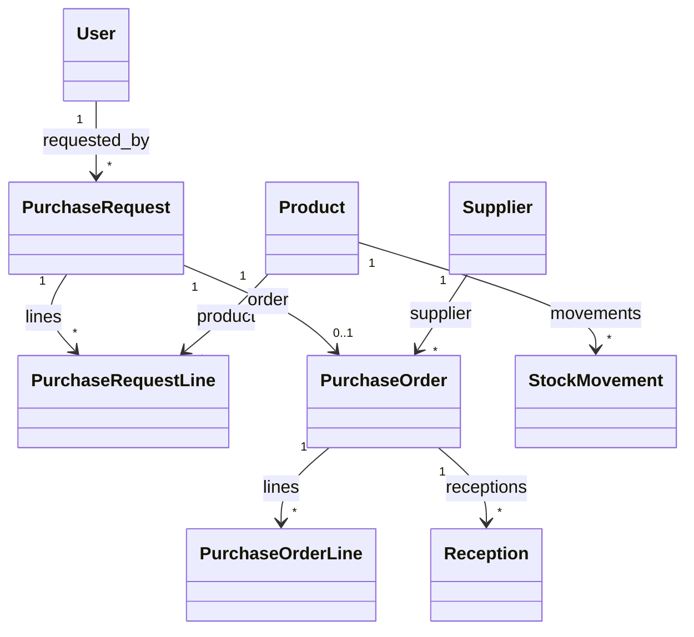

# Class diagram

Placeholder pour le diagramme de classes.

```mermaid
classDiagram
  User "1" --> "*" PurchaseRequest : requested_by
  PurchaseRequest "1" --> "*" PurchaseRequestLine : lines
  Product "1" --> "*" PurchaseRequestLine : product
  PurchaseRequest "1" --> "0..1" PurchaseOrder : order
  PurchaseOrder "1" --> "*" PurchaseOrderLine : lines
  Supplier "1" --> "*" PurchaseOrder : supplier
  PurchaseOrder "1" --> "*" Reception : receptions
  Product "1" --> "*" StockMovement : movements
```
