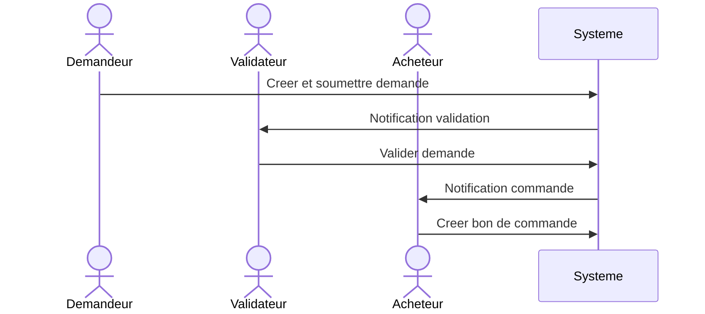
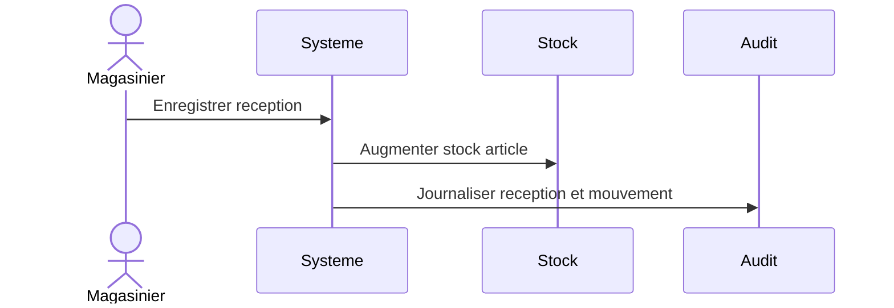

# Sequence diagrams

## Demande vers commande

```mermaid
sequenceDiagram
  actor Demandeur
  actor Validateur
  actor Acheteur
  Demandeur->>Systeme: Creer et soumettre demande
  Systeme->>Validateur: Notification validation
  Validateur->>Systeme: Valider demande
  Systeme->>Acheteur: Notification commande
  Acheteur->>Systeme: Creer bon de commande
```

## Reception et stock

```mermaid
sequenceDiagram
  actor Magasinier
  Magasinier->>Systeme: Enregistrer reception
  Systeme->>Stock: Augmenter stock article
  Systeme->>Audit: Journaliser reception et mouvement
```
