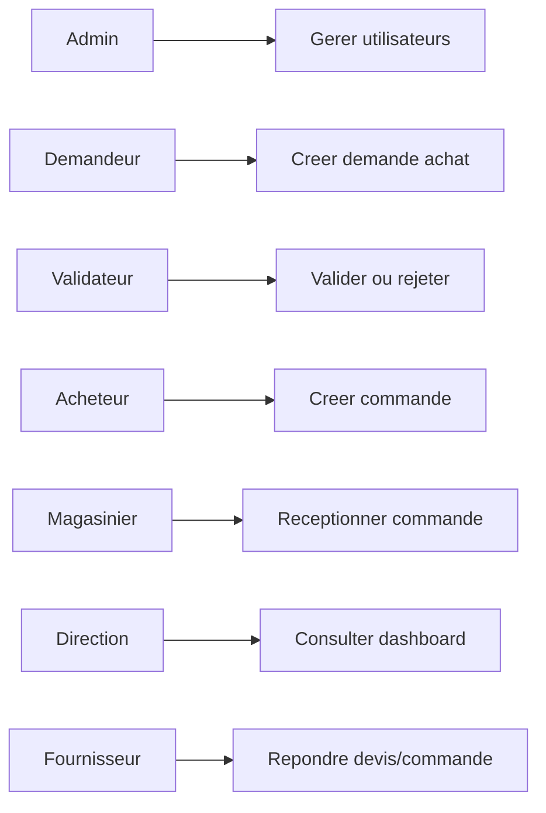

# Use case diagram

Placeholder pour le diagramme de cas d'utilisation.

```mermaid
flowchart LR
  Admin[Admin] --> Users[Gerer utilisateurs]
  Demandeur[Demandeur] --> CreateRequest[Creer demande achat]
  Validateur[Validateur] --> Validate[Valider ou rejeter]
  Acheteur[Acheteur] --> Order[Creer commande]
  Magasinier[Magasinier] --> Receive[Receptionner commande]
  Direction[Direction] --> Dashboard[Consulter dashboard]
  Fournisseur[Fournisseur] --> Quote[Repondre devis/commande]
```
